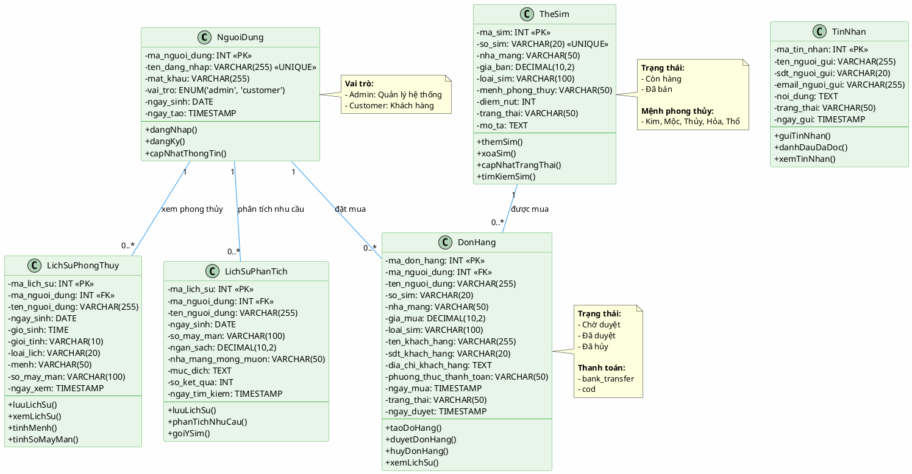

# Sơ Đồ Lớp - Hệ Thống Sim Số Đẹp Phong Thủy

## Mô tả
Sơ đồ lớp mô tả cấu trúc dữ liệu và quan hệ giữa các thực thể trong hệ thống.

## Sơ đồ PlantUML

## Giải thích các lớp

### 1. NguoiDung (User)
- **Mô tả**: Quản lý thông tin người dùng (Admin và Customer)
- **Thuộc tính chính**: 
  - `ma_nguoi_dung`: ID người dùng (Primary Key)
  - `ten_dang_nhap`: Tên đăng nhập (Unique)
  - `vai_tro`: Phân quyền (admin/customer)
  - `ngay_sinh`: Ngày sinh (dùng cho phong thủy)
- **Chức năng**: Đăng nhập, đăng ký, cập nhật thông tin

### 2. TheSim (Sim Card)
- **Mô tả**: Quản lý thông tin sim số đẹp
- **Thuộc tính chính**:
  - `ma_sim`: ID sim (Primary Key)
  - `so_sim`: Số điện thoại (Unique)
  - `menh_phong_thuy`: Mệnh phù hợp (Kim/Mộc/Thủy/Hỏa/Thổ)
  - `diem_nut`: Điểm phong thủy (1-10)
  - `trang_thai`: Còn hàng/Đã bán
- **Chức năng**: Thêm, xóa, cập nhật, tìm kiếm sim

### 3. DonHang (Purchase Order)
- **Mô tả**: Quản lý đơn hàng mua sim
- **Thuộc tính chính**:
  - `ma_don_hang`: ID đơn hàng (Primary Key)
  - `ma_nguoi_dung`: ID người mua (Foreign Key)
  - `trang_thai`: Chờ duyệt/Đã duyệt/Đã hủy
  - `phuong_thuc_thanh_toan`: Chuyển khoản/COD
- **Chức năng**: Tạo đơn, duyệt đơn, hủy đơn, xem lịch sử

### 4. LichSuPhongThuy (Feng Shui History)
- **Mô tả**: Lưu lịch sử xem phong thủy
- **Thuộc tính chính**:
  - `ma_lich_su`: ID lịch sử (Primary Key)
  - `ma_nguoi_dung`: ID người xem (Foreign Key)
  - `menh`: Mệnh ngũ hành
  - `so_may_man`: Các số may mắn
- **Chức năng**: Tính mệnh, tính số may mắn, lưu lịch sử

### 5. LichSuPhanTich (Recommendation History)
- **Mô tả**: Lưu lịch sử phân tích nhu cầu AI
- **Thuộc tính chính**:
  - `ma_lich_su`: ID lịch sử (Primary Key)
  - `ma_nguoi_dung`: ID người dùng (Foreign Key)
  - `muc_dich`: Mục đích sử dụng sim
  - `so_ket_qua`: Số lượng sim gợi ý
- **Chức năng**: Phân tích nhu cầu, gợi ý sim phù hợp

### 6. TinNhan (Contact Message)
- **Mô tả**: Quản lý tin nhắn liên hệ từ khách hàng
- **Thuộc tính chính**:
  - `ma_tin_nhan`: ID tin nhắn (Primary Key)
  - `trang_thai`: Chưa đọc/Đã đọc
- **Chức năng**: Gửi tin nhắn, đánh dấu đã đọc

## Quan hệ giữa các lớp

1. **NguoiDung - DonHang**: 1-N (Một người dùng có thể đặt nhiều đơn hàng)
2. **NguoiDung - LichSuPhongThuy**: 1-N (Một người dùng có thể xem phong thủy nhiều lần)
3. **NguoiDung - LichSuPhanTich**: 1-N (Một người dùng có thể phân tích nhiều lần)
4. **TheSim - DonHang**: 1-N (Một sim có thể xuất hiện trong nhiều đơn hàng lịch sử)

## Cách sử dụng

### Để tạo sơ đồ từ code PlantUML:

1. **Online**: 
   - Truy cập: https://www.plantuml.com/plantuml/uml/
   - Copy code PlantUML ở trên
   - Paste vào và xem kết quả

2. **VS Code**:
   - Cài extension: "PlantUML"
   - Mở file này
   - Nhấn `Alt + D` để xem preview

3. **Export**:
   - Export sang PNG, SVG, PDF để đưa vào báo cáo

## Ghi chú

- Sơ đồ này mô tả cấu trúc database và logic nghiệp vụ chính
- Các thuộc tính và phương thức có thể được mở rộng thêm
- Quan hệ giữa các lớp phản ánh foreign key trong database
